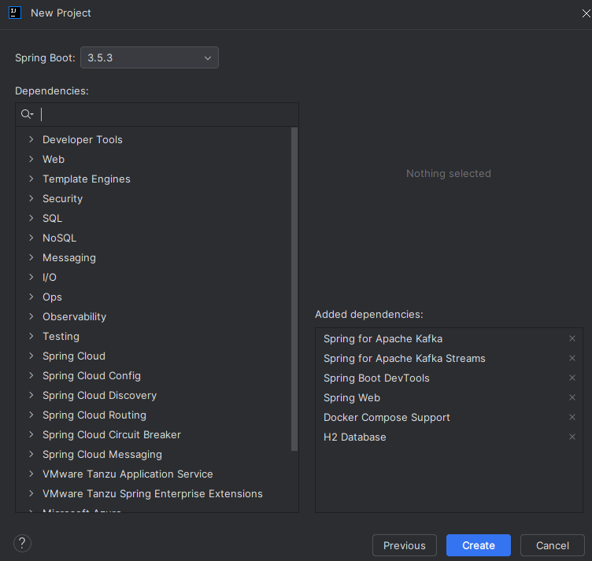
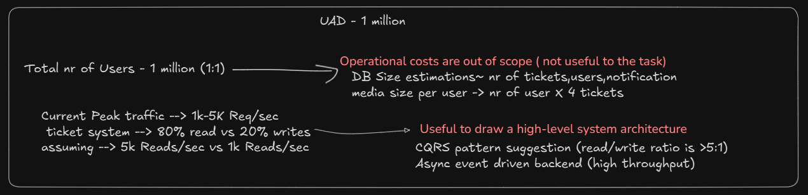
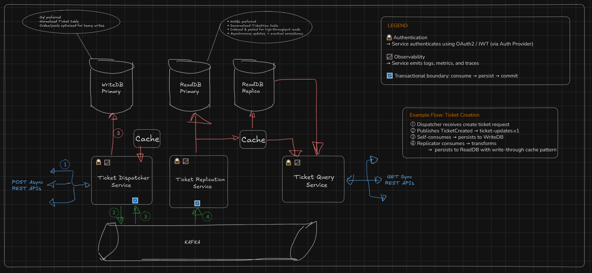
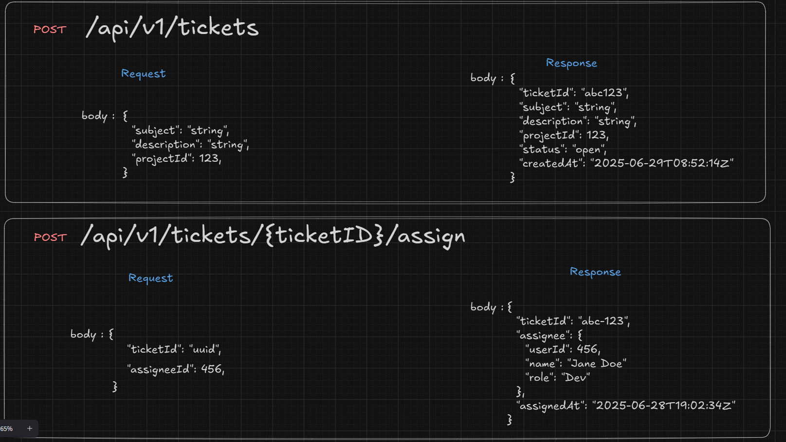
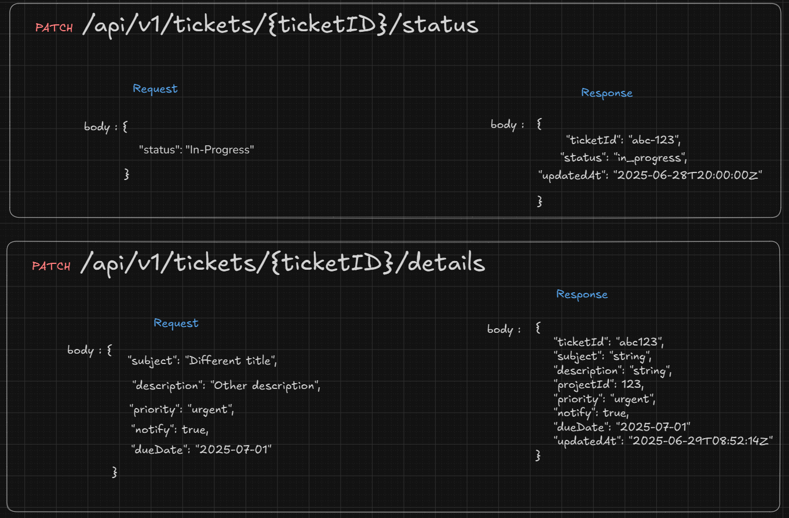
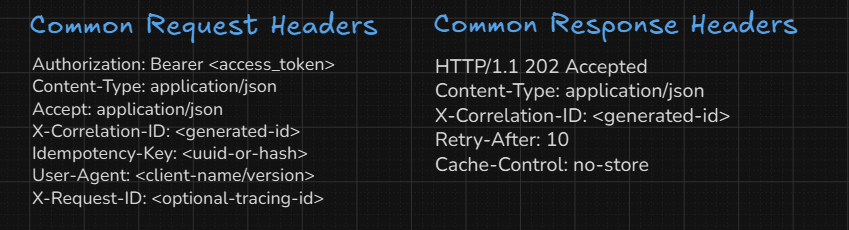
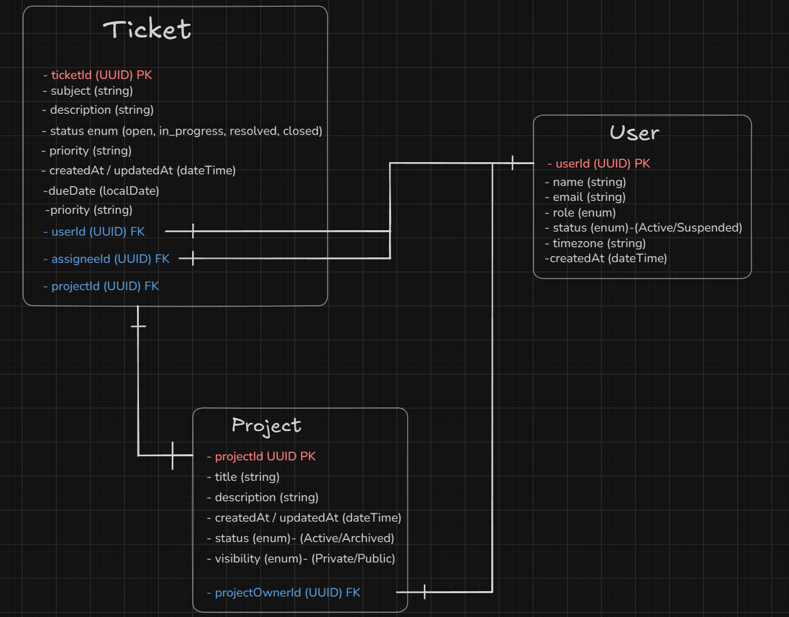

# Design and Implementation consideration

## 0. Ticketing System Task breakdown
The following is an overview of all the steps taken in order to complete the task assigned.

1. Research:
   - Gather non-functional requirements
   - Design high-level system architecture
   - API and data model design
   - Derive design decision and impacts for the task.

2. Application development:
   - Generate project scaffolding [(Spring Initializr)](https://start.spring.io/)
   - Create API contract [(OpenAPI Spec)](https://swagger.io/specification/)
   - Generate REST controllers and models [(Swagger Codegen)](https://swagger.io/tools/swagger-codegen/)
   - Implement cross-cutting concerns (exception handling,security,logging filter,audit etc.) [(Claude 4.0)](https://www.anthropic.com/news/claude-4)
   - Refactor code:
       - separate layers
       - apply best practices
       - fix/debug issues
   - Create custom metrics

3. Testing/tuning phase:
   - Apply performance tuning
   - Create integration test for business logic validation.
   - Create load tests to tweak and validate performance metrics.
   - Create mock tests for failure scenarios.

4. Cloud DevOps:
   - Create multi-stage dockerfile:
     - Tune alpine base image
     - Apply JVM tuning
     - Enforce runtime security constraints
   - Create docker compose.yaml ( K8S is superior for container orchestration )

Breakdown into sub-tickets:
- PLS-1 : Research
- PLS-2 : Application development
- PLS-3 : Testing/tuning phase
- PLS-4 : Cloud DevOps


## 2.1. Generated project scaffolding
We started here in order to have a repo and have a folder structure to start with.



## 1.0 Research

### 1.1 Gather non-functional requirements
For this section I used ChatGPT's deep research mode to save time digging for real numbers on current stack and traffic loads.

#### Current stack
Analysis of Pleased.com’s public site and job postings reveals a modern cloud-native SaaS stack. 
The **frontend** is built with Vue.js (with Vuex, Vuetify, TypeScript) and even uses Firebase for real-time features. The **backend** is implemented in Java (Spring Boot/Spring Data) on AWS, using Docker containers orchestrated by Kubernetes. Data storage uses a relational SQL database (MySQL), with Redis for caching and RabbitMQ (or similar MQ) for asynchronous messaging. CI/CD is handled via Jenkins, and static assets (HTML/CSS/JS/images) are likely served through a CDN (e.g. AWS CloudFront) for low latency.

* Key inferred components include:
* **Frontend:** Vue.js (Vuex, Vuetify), SCSS, Webpack, Firebase Realtime Database.
* **Backend:** Java 8+ (Spring Boot/Security), RESTful APIs, Microservices architecture.
* **Database:** MySQL (primary), possibly read-replicas or sharding for scale; Redis for in-memory caching.
* **DevOps/Infra:** AWS Cloud (EC2, EKS/ECS), Docker & Kubernetes for containers; Jenkins pipelines; CloudWatch/Prometheus for monitoring.
* **CDN/Caching:** Likely a CDN (CloudFront or similar) for static content; use of HTTP caching headers and Redis/CloudCache to speed up API responses.
* **Auxiliary:** Service registry/discovery (Kubernetes DNS or Consul) and API gateway (e.g. Envoy/Nginx) for routing. (Slack, a similar SaaS, uses Envoy and siloed “cells” to route traffic.)

Collectively, these point to a microservices-based design on AWS, optimized for scalability and agility. Indeed, Pleased’s job descriptions explicitly mention Docker/K8s microservices to handle “hundreds of thousands of customers a day”, mirroring architectures used by large SaaS like Zendesk (which moved from a Rails monolith to Kubernetes).

#### Traffic and Load Estimates
Pleased targets **high volume** but smaller scale than global giants. Job postings claim “hundred and thousands of customers a day” (interpreted as 10^5–10^6 daily users). For context, large SaaS platforms see enormous loads (Atlassian’s Tenant Context Service handled \~32 billion requests/day, peaking \~586k requests/sec; Slack supports millions of concurrent chat events). We should assume Pleased’s usage pattern is **spiky** (peaks during business hours) with possibly thousands of requests per second at load peaks.

Recommendations for handling this include: use AWS **Auto Scaling** for compute (EC2/ECS/EKS) so instances scale with load; deploy services across multiple Availability Zones for fault tolerance; and employ **load balancers** (ALB/NLB) and DNS-based traffic distribution. Caching layers (Redis caches, CDN edge caches) will reduce DB/API load. Queue systems (RabbitMQ/Kafka) can smooth bursts by decoupling writes. These patterns are common in high-traffic SaaS: e.g. Slack’s cell-based AWS architecture isolates AZ failures, allowing quick traffic shifts away from failing zones.

> **Usage Analogy Table (Examples):**

> | Platform             | Scale (daily)                | Notes/Tech                                         |
> | -------------------- | ---------------------------- | -------------------------------------------------- |
> | Pleased.com (est.)   | \~10^5–10^6 users/day        | Java/Spring, MySQL, AWS/K8s; thousands req/s peak. |
> | Slack (chat SaaS)    | Millions of users (events)   | AWS region-based cells, Envoy routers, EKS.        |
> | Atlassian TCS (META) | \~32×10^9 req/day (586k/sec) | DynamoDB + in-memory cache + SNS invalidation.     |

### 1.2 Design high-level system architecture (L3)
Using the data above we can create some rough estimates on the non-functional requirements.
<br>Since this is a day-to-day business tool than the active daily users will match to the total nr of users.
<br>Current peak traffic can be estimated in the thousands.
<br>Due to the type of application we can assume there will be substantially more lookups on the ticket versus the ticket creations/updates.
<br>Additionally, analytics workloads and reporting tools will further drive up read pressure on the system.


The ratio between reads and writes coupled with the fact that this threshold surpasses 500-1k req/sec is able to justify a CQRS architecture pattern.


The rest api call flow is simplified to only publish events to kafka. 
Seperate consumer services will process the events and persist the data to the database.

#### CQRS - Performance Metrics: Before vs After
The statistics below support the pattern selected for splitting the db entities between the Ticket Dispatcher and Query Service. (Source: Claude 4.0)
<br>**Single Database (Before):**
```
Total Capacity: 1000 IOPS
├── Writes: 200 IOPS (20%)
├── Reads: 800 IOPS (80%)
└── Contention: High (reads blocked by writes)

Query Performance:
├── Simple reads: 50ms (blocked by writes)
├── Complex reads: 500ms (competing for resources)
└── Peak hour degradation: 3x slower
```
**Separate Databases (After):**
```
Write Database: 1000 IOPS dedicated
├── Writes: 200 IOPS (20% utilized)
├── Spare capacity: 800 IOPS
└── Contention: None

Read Database: 2000 IOPS dedicated  
├── Reads: 800 IOPS (40% utilized)
├── Spare capacity: 1200 IOPS
└── Contention: None

Query Performance:
├── Simple reads: 5ms (no write interference)
├── Complex reads: 50ms (optimized indexes)
└── Peak hour performance: Consistent
```

### 1.3 API and data model design
As derived by the requirements document. User should be able to:
- Create a ticket with minimal info
- Assign the ticket to a user
- Update ticket status
- Update ticket details (Out of scope, but crucial for MVP)

<br>The following are whiteboard API design sketches:






The designs were fed into ChatGPT to generate the OpenAPI v2 schema file [TicketDispatcher-v1.0.yaml](docs/TicketDispatcher-v1.0.yaml). 
<br>The schemas generated had unresolved references and were fixed/enhanced appropriately.

<br>Below is the data model design:

The designs were fed into ChatGPT to generate DB entities and repositories.

### 1.4 Design decision and impacts for the task.

#### 1.4.1 JDK choice
Due to the current stack in use, I will be developing this application using the latest jdk 8 stable version of spring boot : 2.7.18.
<br>Upgrading to JDK 21 LTS will give 2-3x better performance.
<br>Here are some considerations of why it's beneficial to upgrade to jdk 21 (Source: Claude 4.0):

1. Virtual Threads - JDK 21+ only
```java
// JDK 21 only
Executors.newVirtualThreadPerTaskExecutor()

// JDK 8 equivalent
ThreadPoolTaskExecutor executor = new ThreadPoolTaskExecutor();
```

2. ZGC Garbage Collector- JDK 11+ only
```bash
# JDK 21
-XX:+UseZGC

# JDK 8 maximum
-XX:+UseG1GC
```

3. Modern JVM Flags - Many are JDK 11+ only

JDK 8 Performance Limitations:
```
- Throughput: ~10-15K req/sec (vs 25-30K on JDK 21)
- Memory: Need 8GB heap vs 4GB on JDK 21
- Threads: Limited to ~800-1000 platform threads
- GC Pauses: 10-50ms (vs <1ms on JDK 21)
```
#### 1.4.2 Idempotence 
Will be enforced through an Idempotency-Key requirement as a header request.
The key will be used and propagated to an eventId by the kafka publishers. 
For ticket creation flow, the kafka consumers will use this UUID as the ticketID value to persist to DB.
Using the eventId as the ticketId ensures end-to-end traceability across system boundaries. 
This enables consistent correlation between API requests, Kafka events, database records, and observability tools — greatly simplifying debugging, monitoring, and incident response.

#### 1.4.3 Tracing
- Client supplies an X-Correlation-ID header if it wants to track the full lifecycle.
- Server will generate a new one if missing.
- Server will always propagate it downstream (Kafka, logs, responses).

#### 1.4.4 Webflux (Reactive) vs traditional Async(thread-based concurrency)
(Source:Claude 4.0)
```REST API (WebFlux) → Kafka → Consumer Service (Traditional or Reactive)```

**Non-blocking I/O**:
- WebFlux uses event loops with far fewer threads (typically 2x CPU cores)
- Spring MVC blocks threads during Kafka publishing - you need thread pools sized for peak concurrent requests
- For 1000 concurrent requests: WebFlux uses ~8-16 threads, MVC needs ~1000 threads

**Memory Efficiency**:
- Each blocked thread in MVC consumes ~1MB stack space
- WebFlux shares threads across all requests
- 1000 concurrent: WebFlux ~16MB vs MVC ~1GB thread overhead

**Backpressure Handling**:
- WebFlux naturally handles slow Kafka brokers without blocking request threads
- MVC threads get stuck waiting, causing cascade failures under load


## Reference and links
